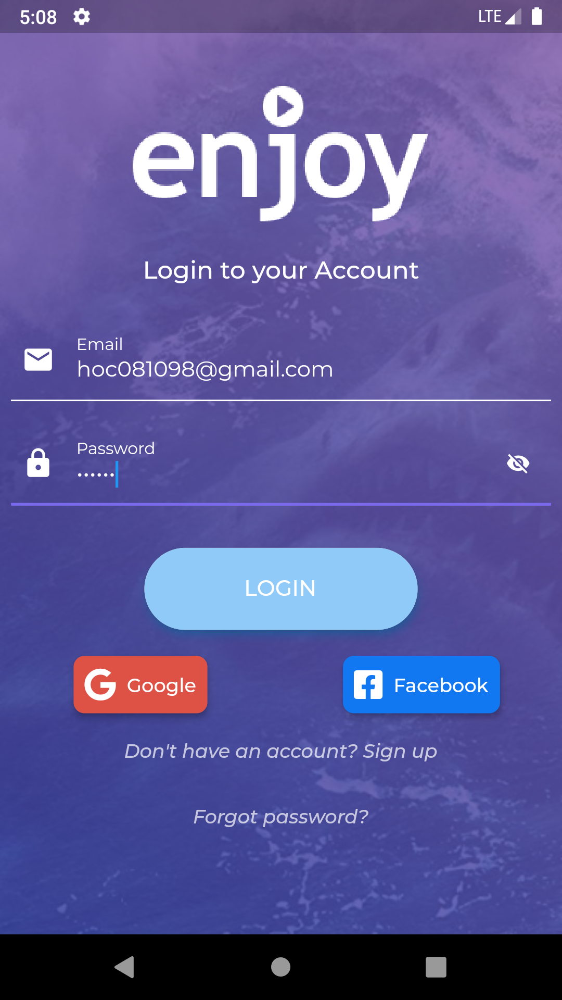

# DATN

## Directory structure
```
project
│   README.md
│
└───Backend
│   └───main                   <- [Backend]
│       │   ...
│       │   ...
│   
└───Docs
│   │   Database.zip
│   │   Diagram.png
│   │   diagram_sql.png
│
└───MobileApp
│   └───datn                   <- [User mobile app]
│   │   │   ...
│   │   │   ...
│   │
│   └───movie_admin            <- [Admin, staff mobile app]
│       │   ...
│       │   ...
│
└───Screenshots
    │   Screenshot_add_card.png
    │   Screenshot_add_comment.png
    │   ...
```

## Setup and run

-   Download APK: 
    -   [User APK](https://github.com/hoc081098/DATN/blob/master/MobileApp/datn/build/app/outputs/flutter-apk/app-release.apk)
    -   [Admin APK](https://github.com/hoc081098/DATN/blob/master/MobileApp/movie_admin/build/app/outputs/flutter-apk/app-release.apk)
    
## Screenshots

|  |  |  |
| :---:  | :---:  | :---:  |
|  |  |  
|   |   |  
|   |   |  